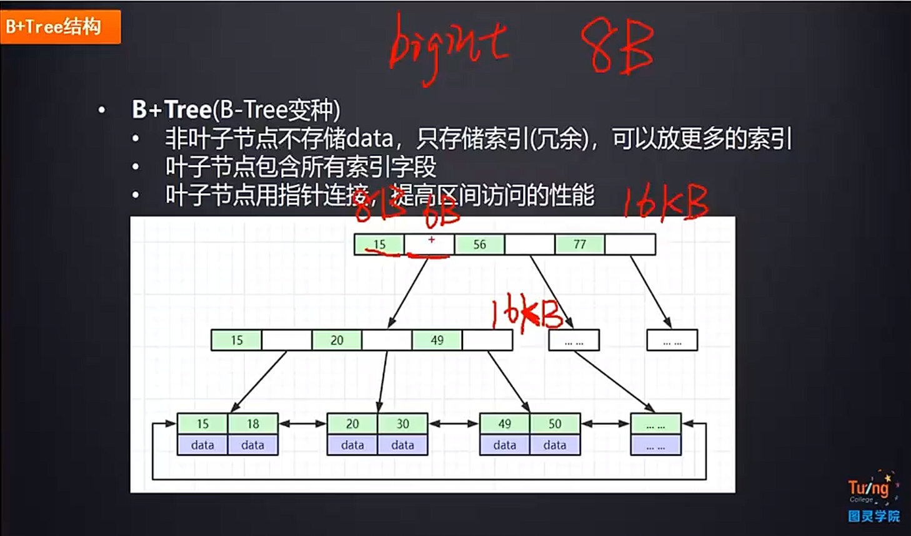
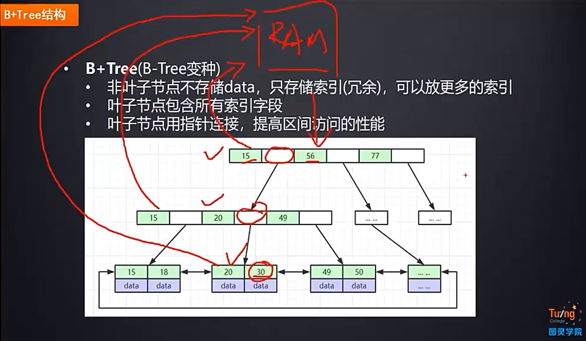
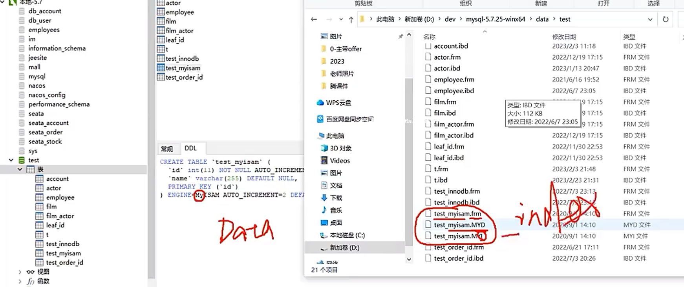
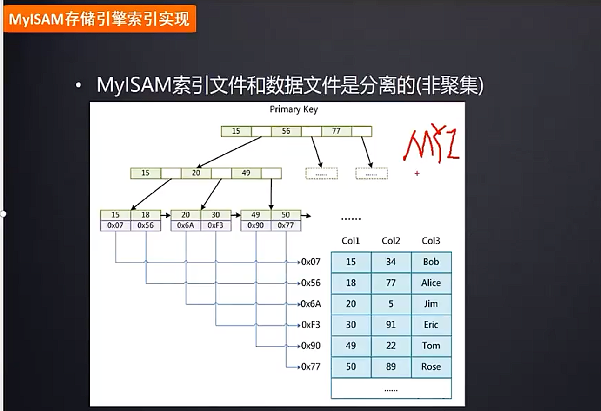
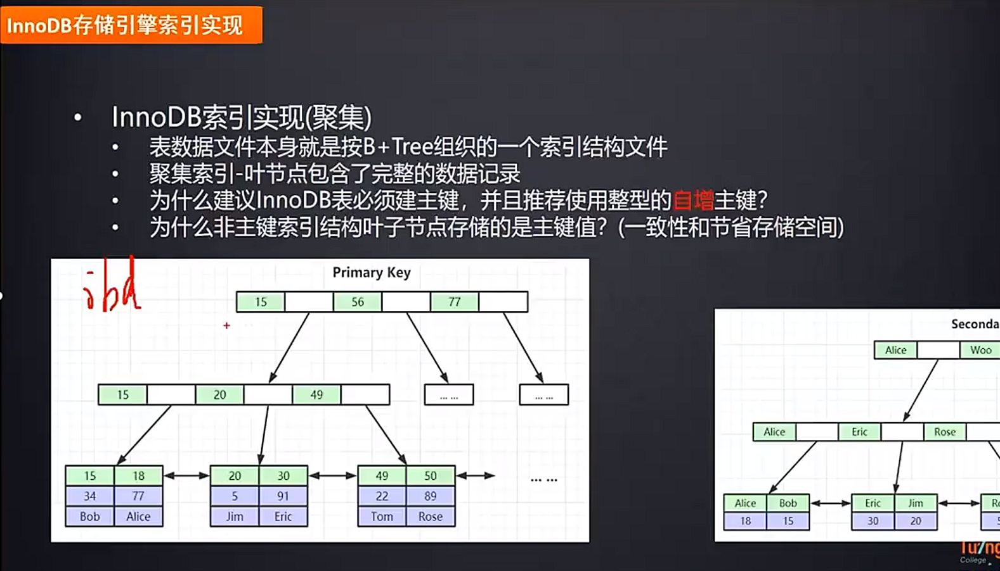
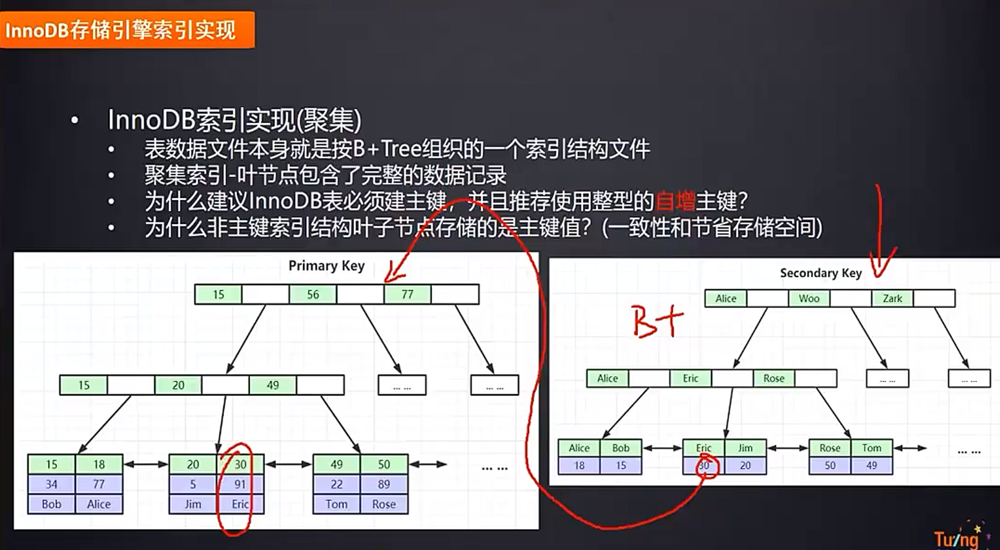
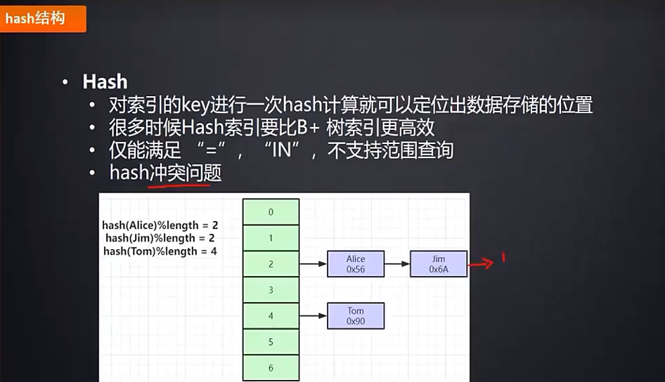
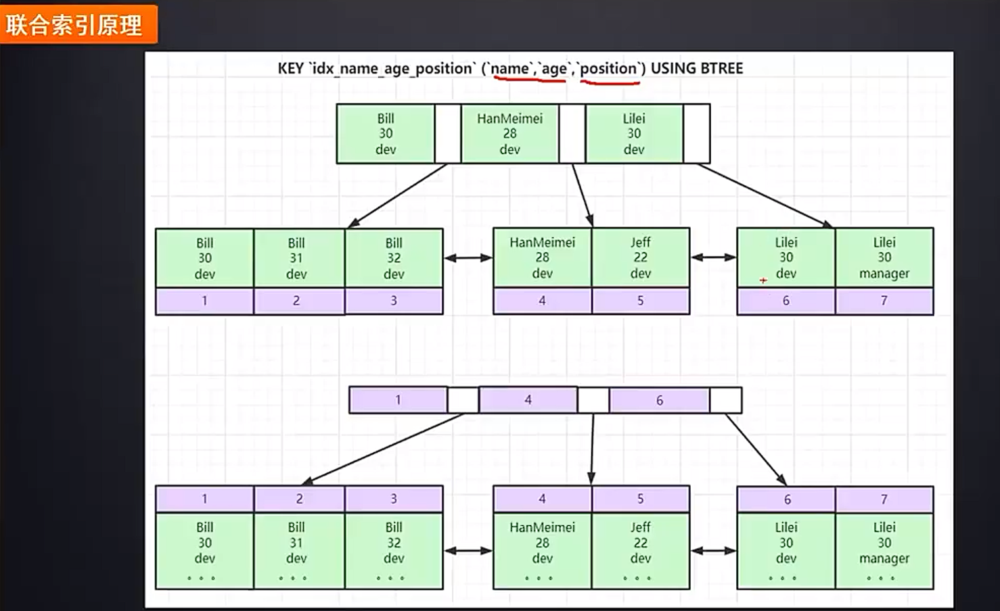

位置：com.atcode.watermall.product.thread.MysqlTest.MysqlTest01

    /**
     * 判断数据库是读密集型or写密集型or读写密集型
     * 可以看出很长一段时间内的数据库的整体性能
     * use gulimall_pms;
     * show global status like'Com_select';
     * show global status like'Com_insert';
     * show global status like'Com_update';
     * show global status like'Com_delete';
     * show global status like'Com_______';
     */

    /**
     * 慢查询日志
     * 慢查询日志可以将较慢的DQL语句记录下来，便于我们定位需要优化的select语句
     * 通过以下命令判断慢查询日志是否开启    该功能默认是关闭的
     * show variables like 'slow_query_log';
     * 慢查询日志默认是关闭的，可以通过修改my.ini文件来开启慢查询日志功能，可以在my.ini的[mysqld]后面添加如下配置：
     * '
     *  [mysqld]
     *  slow_query_log = 1
     *  long_query_time = 3
     *  '
     *  slow_query_log = 1 表示开启慢查询日志功能
     *  long_query_time = 3 表示只要select的语句耗时超过三秒就会记录到慢查询日志中
     *  日志位置和bin同级的data下的yourcomputername-slow.log文件下
     *  注意：Windows下my.ini文件需要自己新建，linux/mac下的后缀是.cnf
     */

    /**
     * profiling
     * 查看当前数据库是否支持profile操作
     * select @@have_profiling;
     *
     * 查看profiling开关是否开启(注意navicat for mysql是默认开启的,dos命令窗口则不一定是)
     * select @@profiling;
     *
     * 可以通过以下方式把profiling开关打开
     * set profiling = 1;
     *
     * 
     */

二叉树：递增或递减数据最后会成链表
红黑树（二叉平衡树）：层级太高，I/O次数太多
B树: 叶结点具有相同的深度，叶结点的指针为空，所有索引元素不重复，结点中的数据索引从左到右递增
B+树: 相对于B树，只有叶子结点带数据，中间结点不带数据
对于InnoDB,一个结点的大小为16KB 索引中间存的是下一个结点的磁盘空间地址，大约6B  
第三级能存储两千多万行数据

如果要查30，先把最高级结点加载到内存中，然后把下一级加载，最后加载存数据的结点，三次IO
对于mysql高级版本，非叶子结点(索引)都是存在内存中，也就是只需要查找一次IO即可

不同的存储引擎，如果是myisam data和index分开存储，如果是innoDB,data和Index一起存储

myisam存储引擎中叶子节点存的是对应索引所在磁盘地址

select * from teble_name where co1=30 执行流程
首先看是不是索引列，如果是，那么走索引
InnoDB

叶子结点放的是索引所在列的数据

聚集索引-叶子结点包含了所有的记录的索引InnoDB的主键索引
非聚集索引-索引文件和数据文件分离，也就是Myisam的主键索引

回表：myisam存储引擎走索引就是回表，从索引文件到数据文件(从索引拿到地址，然后再去找)
对于InnoDB 下面这种也是非聚集索引，存在一次回表操作
如果不是主键作为聚集索引，那么这个索引的叶子结点存的是主键id，然后再走一遍主键的索引

为什么建议InnoDB必须建主键呢
建立这个是为了让mysql可以有一个B+树去查找
如果不建立，那么就会自己找这张表的第一个唯一索引，把那个索引放到b+树来维护整张表的数据
如果也没有唯一索引，那么会有一个隐藏列row_id 这个是隐藏字段，不会对你开放

为什么建议InnoDB建议主键为整型自增呢  数字对比快  如果是不自增的UUID,那么如果要新增一个UUID，
之前的一个结点已经达到16KB的最大值了，此时再新增就会出现问题，
当前结点会进行一个变动，一般是进行分裂，这样会影响sql的执行时间，如果是自增就不会出现这个问题
也就是使用自增的主键，对于需要insert的数据不会有性能影响

对于分库分表，自增id重复怎么办，雪花算法解决  雪花算法不是严格递增是趋势递增

hash索引 缺点，不支持范围查找

联合索引
联合索引的底层数据结构

对于索引的最左前缀法则，如果要会用索引，应该从联合索引的最左边开始

最左优化原则底层的实现原理