# SmartWaterMallSystem
智能水产品商城系统

nacos闪退解决方法：
startup -m standalone

/**
* 想要远程调用别的服务
* 1.引入open-feign
* 2.编写一个接口告诉springcloud这个接口需要调用远程服务 统一放在fegin包下
*    声明接口的每一个方法都是调用哪个远程服务的哪个请求
* 3.开启远程调用的功能  @EnableFeignClients
  */

20241126下午存在的问题： nacos配置中心内容修改之后只能在服务(coupon)重新启动之后才生效
nacos作为配置中心:以coupons服务为例
com.atcode.watermall.coupon.WatermallCouponApplication
/**
* 1、如何使用nacos作为配置中心统一管理配置
*     1)、引入依赖
*             <dependency>
*                 <groupId>com.alibaba.cloud</groupId>
*                 <artifactId>spring-cloud-starter-alibaba-nacos-config</artifactId>
*             </dependency>
*     2)、创建一个bootstrap.properties
*          #服务名称
*          spring.application.name=watermall-coupon
*          #配置中心的地址
*          spring.cloud.nacos.config.server-addr=127.0.0.1:8848
*     3)、需要给配置中心默认添加一个叫数据集（Data Id）watermall-coupon.默认规则，(应用名.properties)
*     4)、给 应用名.properties 添加任何配置
*     5）、动态获取配置
*          @RefreshScope:动态获取并刷新配置
*          @Value("${配置项的名}")：获取到配置
*          如果配置中心和当前应用的配置文件中都配置了相同的项，优先使用配置中心的配置
* 2、细节
*      1)、命名空间，配置隔离
*          默认：public（保留空间）；默认新增的所有配置都在public空间
*          1、开发、测试、生产;利用命名空间做环境隔离
*              注意：在bootstrap.properties配置上，需要使用哪个命名空间下的配置
*              spring.cloud.nacos.config.namespace=65875baf-002a-4bd1-a3b8-9547b7ba1fe2
*          2、每一个微服务之间互相隔离配置，每一个微服务都创建自己的命名空间，只加载自己命名和空间下的所有配置
*      2)、配置集：所有配置的集合
*      3)、配置集ID：类似文件名
*          DataID:类似文件名
*      4)、配置分组
*          默认所有的配置集都属于：DEFAULT_GROUP
*      项目中的使用：每个微服务创建自己的命名空间，使用配置分组区分的环境，dev,test,prop
*  3、同时加载多个配置集
*      1)、微服務任何配置信息，任何配置文件都可以放在配置中心中
*      2)、只需要在bootstrap.properties说明加载配置中心哪些配置文件即可
*      3)、@Value、@ConfigurationPropeties...以前SpringBoot任何方法从配置文件中获取，都能使用配置中心有的优先使用配置中心的
*/

配置网关：
  解决datasource冲突问题：
    @SpringBootApplication(exclude = {DataSourceAutoConfiguration.class})
  解决Web冲突问题：
     在properties文件加入 spring.main.web-application-type=reactive

JAVA8新特性内容，在创建查询三级目录时的serviceimpl层
  List<CategoryEntity> level1Menu = entities.stream().filter((categoryEntity) -> {
  return categoryEntity.getParentCid() == 0;
   }).collect(Collectors.toList());

解决lombok插件失效的问题：使用标准的javabean

# 路由id，自定义，只要唯一即可
        - id: admin_route
# uri路由的目标地址。lb就是负载均衡，后面跟服务名称。
          uri: lb://renren-fast
          #断言工厂的Path，请求路径必须符合指定规则
          predicates:
            - Path=/api/**    # 把所有api开头的请求都转发给renren-fast
          #局部过滤器。回顾默认过滤器default-filters是与routes同级
          filters:
#路径重写。逗号左边是原路径，右边是重写后的路径
- RewritePath=/api/(?<segment>.*),/renren-fast/$\{segment}
# 默认规则， 请求过来：http://localhost:88/api/captcha.jpg   转发-->  http://renren-fast:8080/renren-fast/captcha.jpg

配置跨域的关键代码：
public CorsWebFilter corsWebFilter(){
UrlBasedCorsConfigurationSource source = new UrlBasedCorsConfigurationSource();

        CorsConfiguration corsConfiguration= new CorsConfiguration();
        //1、配置跨域
        // 允许跨域的请求头
        corsConfiguration.addAllowedHeader("*");
        // 允许跨域的请求方式
        corsConfiguration.addAllowedMethod("*");
        // 允许跨域的请求来源
        corsConfiguration.addAllowedOriginPattern("*");
//注释的这句会报错。因为当allowCredentials为真时，allowedorigin不能包含特殊值"*"，因为不能在"访问-控制-起源“响应头中设置该值。

//corsConfiguration.addAllowedOrigin("*");//这句会报错

// 是否允许携带cookie跨域

corsConfiguration.setAllowCredentials(true);

        // 任意url都要进行跨域配置，两个*号就是可以匹配包含0到多个/的路径
        source.registerCorsConfiguration("/**",corsConfiguration);
        return new CorsWebFilter(source);

    }

注意: application.yaml文件中配置的是服务的命名空间，bootstrap.properties文件中配置的是配置中心的命名空间
      两者不一样！！！！！

  统一封装错误状态码
正规开发过程中，错误状态码有着严格的定义规则
错误码和错误信息定义类：
1. 错误码定义规则为五位数字
2. 前两位表示业务场景，最后三位表示错误码。例如：100001。10:通用 001:系统未知异常
3. 维护错误码后需要维护错误描述，将他们定义为枚举形式
   //错误码和错误信息定义类：
  
   //        1. 错误码定义规则为五位数字

   //        2. 前两位表示业务场景，最后三位表示错误码。例如：100001。10:通用 001:系统未知异常
  
   //        3. 维护错误码后需要维护错误描述，将他们定义为枚举形式

   //        错误码列表（前两位业务场景）：

   //         10: 通用
   //             如10001：参数格式校验失败

   //         11: 商品

   //         12: 订单

   //         13: 购物车

   //         14: 物流

JSR303
/**
* JSR303
* 1.给bean添加javax.validation.constraints.* ,并定义自己的message提示
* 2.开启校验功能@Valid
* 3.校验的Bean后紧跟一个BindingResult,就可以获取到校验的结果  此参数能够得到异常的信息
  */
* 
  //@RequestMapping("/save")
  
* //    public R save(@Valid @RequestBody BrandEntity brand, BindingResult result){
  
* //        if (result.hasErrors()){
 
* //            Map<String, String> map = new HashMap<>();
  
* //            //1、获取校验的结果
 
* //            result.getFieldErrors().forEach((item)->{
  
* //                //获取到错误提示
 
* //                String message = item.getDefaultMessage();
  
* //                //获取到错误属性的名字(校验错误的字段)
 
* //                String field = item.getField();
  
* //                map.put(field, message);
  
* //            });
  
* //            return R.error().put("data", map);
  
* //        }else{
  
* //            brandService.save(brand);
 
* //        }
  
* //        return R.ok();
  
* //    }
 
* 参数校验异常
/** 位置 product/entity/BrandEneity.class
* 关于参数校验异常
* @NotEmpty和@NotBlank区别：
* @NotEmpty非空，不能是null和""
* @NotBlank 非空白，不能是null和""和"  "
* 自定义校验规则@Pattern(regexp = "^[a-zA-Z]$", message = "检索首字母必须是一个字母")
* 1.要给实体类对应的属性添加注解，在注解上也可以自定义message
* 2.在Controller层也要添加注解 @Valid
* 
  */
* {"name": "aa", "logo": "https://www.baidu.com","sort":"1","firstLetter":"A"}

  统一异常处理
/**  位置 com.atcode.watermall.product.exception.WatermallExceptionControllerAdvice
* 统一的异常处理  使用SpringMVC提供的 @ControllerAdvice
* 集中处理所有异常
* @ResponseBody 该注解用于返回json的数据
* @RestControllerAdvice =  @ControllerAdvice + @ResponseBody
* @ExceptionHandler(value = MethodArgumentNotValidException.class)  
* 上一个注解能让SpringMVC知道 此异常处理器类能处理什么异常 value 初始可以用Exception.class，测试获得异常类型
* 捕获到异常之后可以用更详细的  MethodArgumentNotValidException
* bindingResult.getFieldErrors() 获得数据校验的异常的结果
* handleVaildException方法相当于一个精确的异常处理，当这个方法不能捕获到异常时，采用下面的更大范围的异常处理方法handleException
  */

分组校验

位置  product/entity/BrandEneity.class
  分组校验 (JSR303提供的功能)，增改校验分开，@Validated (spring框架提供的规范)  可以完成多场景的复杂校验

    1.@NotBlank(message = "品牌名必须提交",groups = {AddGroup.class,UpdateGroup.class})
      给校验注解标注什么情况需要进行校验
    2.@Validated({AddGroup.class})
    3.默认没有指定分组的校验注解，在分组校验的情况下不生效

  场景：新增时id必须为空，修改时id必须非空，这样实体类注解就凌乱了，这时就必须用到分组校验。

  注意：在common模块中valid包里新建空接口AddGroup,UpdateGroup用来分组

  实体类变量注解分组，代表此变量支持这些分组的校验。
  controller参数对象注解分组，代表这个对象只校验有配置这个分组的成员变量。

自定义校验  

  1.编写一个自定义的校验注解   @ListValue(vals={0,1},groups = {AddGroup.class, UpdateStatusGroup.class})
 
  2.编写一个自定义的校验器

  3.关联自定义的校验器和自定义的校验注解 @Constraint(validatedBy = {ListValueConstraintValidator.class})

示例：

@Documented
//约束。同一个注解可以指定多个不同的校验器，适配不同类型的校验。这里ListValueConstraintValidator.class是数值校验器

@Constraint(validatedBy = {ListValueConstraintValidator.class})
//可以标注在哪些位置。方法、字段等。

@Target({ElementType.METHOD, ElementType.FIELD, ElementType.ANNOTATION_TYPE, ElementType.CONSTRUCTOR, ElementType.PARAMETER, ElementType.TYPE_USE})

//注解的时机。这里是可以在运行时获取校验

@Retention(RetentionPolicy.RUNTIME)
public @interface ListValue {

//    校验出错后，错误信息去哪取。前缀一般是当前全类名，在ValidationMessages.properties配置文件里设置com.atcode.common.validator.ListValue.message=The specified value must be submitted

String message() default "{com.atcode.common.validator.ListValue.message}";
//    支持分组校验的功能

Class<?>[] groups() default {};

//    自定义负载信息

Class<? extends Payload>[] payload() default {};

//    自定义注解里的属性

int[] vals() default {};
}

    关于路径变量注解：@PathVariable
    /**
     * 列表
     */
    @RequestMapping("/list/{catlogId}")
    //@RequiresPermissions("product:attrgroup:list")
    public R list(@RequestParam Map<String, Object> params, @PathVariable("catlogId") Long catlogId){
//        PageUtils page = attrGroupService.queryPage(params);
PageUtils page = attrGroupService.queryPage(params,catlogId);

        return R.ok().put("page", page);
    }

解决前端级联菜单渲染问题： com.atcode.watermall.product.entity.CategoryEntity
	@JsonInclude(JsonInclude.Include.NON_EMPTY)
com.atcode.watermall.product.service.impl.AttrServiceImpl
        /**
         *分页数据中加入当前属性的“所属分类”和“所属分组”
         * 报错原因，selectone可能会出现空指针异常  优化方法是使用!null判断
         * sql优化代码
         */

        //TODO 下面的selectOne位置有bug，需要接收的是一条，但是查到的不是一条   //bug原因，属性分组关系表中只能是一对一的关系  也有可能是下面的代码原因，使用1/0即使是一对多也不会报错
        /**
         * wrapper.eq(AttrEntity::getAttrType,"base".equalsIgnoreCase(attrType)? ProductConstant.AttrEnum.ATTR_TYPE_BASE : ProductConstant.AttrEnum.ATTR_TYPE_SALE);
         */
位置:com.atcode.watermall.product.app.CategoryBrandRelationController
    /**
     * 获取当前分类关联的所有品牌
     * 1、 Controller: 处理请求，接受和校验数据
     * 2、Service接受controller传来的数据，进行业务处理
     * 3、Controller接受Service处理完的数据，封装成页面指定的vo
     */
.common模块创建to，用于不同服务间传数据

TO:Transfer Object 数据传输对象
在应用程序不同关系之间传输的对象。

测试领取采购单的接口
POST http://localhost:88/api//ware/purchase/received
Content-Type: application/json

[3]

参数为采购单id
<> 2024-12-12T163748.200.json

测试采购完成的接口
POST http://localhost:88/api/ware/purchase/done
Content-Type: application/json

{
"id": 3,
"items": [
{"itemId":3,"status":3,"reason":"完成"},
{"itemId":4,"status":3,"reason":"完成"}
]
}

itemid为采购需求的id
<> 2024-12-13T152023.200.json

商城首页 
    模板引擎 thymeleaf-stater 关闭缓存，配置默认启动扫描路径
    静态资源在static文件夹下，可以通过路径直接访问到
    页面在templates文件夹下，也可以直接访问
    SpringBoot访问项目的时候默认会访问Index
  不重启服务器的情况下更新数据
    1.引入devtool
    <dependency>
    <groupId>org.springframework.boot</groupId>
    <artifactId>spring-boot-devtools</artifactId>
            <optional>true</optional>
        </dependency>
    2.重新编译当前页面ctrl+shift+F9

.JMeter压力测试
压力测试考察当前软硬件环境下系统所能承受的最大负荷并帮助找出系统瓶颈所在。 压测都是为了系统在线上的处理能力和稳定性维持在一个标准范围内， 做到心中有数。

使用压力测试， 我们有希望找到很多种用其他测试方法更难发现的错误。 有两种错误类型是:内存泄漏， 并发与同步问题。

内存泄漏：内存泄漏（Memory Leak）是指程序中已动态分配的堆内存由于某种原因程序未释放或无法释放，造成系统内存的浪费，导致程序运行速度减慢甚至系统崩溃等严重后果。

并发与同步：

有效的压力测试系统将应用以下这些关键条件:重复， 并发， 量级， 随机变化。

1.1 压力测试的性能指标
响应时间（Response Time:RT）
响应时间指用户从客户端发起一个请求开始，到客户端接收到从服务器端返回的响应结束，整个过程所耗费的时间。响应时间越少越好。

HPS（Hits Per Second）:每秒点击次数，单位是次/秒。【不是特别重要】

TPS(Transaction per Second）:系统每秒处理交易数，单位是笔/秒。

Qps(Query per Second）:系统每秒处理查询次数，单位是次/秒。
对于互联网业务中，如果某些业务有且仅有一个请求连接，那么TPS=QPS=HPS，一般情况下用 TPS来衡量整个业务流程，用QPS来衡量接口查询次数，用HPS来表示对服务器单击请求。

无论TPS、QPS、HPS,此指标是衡量系统处理能力非常重要的指标，越大越好，根据经
验，一般情况下:
金融行业:1000TPS~5000OTPS，不包括互联网化的活动
保险行业:100TPS~10000OTPS，不包括互联网化的活动
制造行业:10TPS~5000TPS
互联网电子商务:1000OTPS~1000000TPS
互联网中型网站:1000TPS~50000TPS
互联网小型网站:50OTPS~10000TPS

最大响应时间（MaxResponse Time）指用户发出请求或者指令到系统做出反应(响应)的最大时间。

最少响应时间(Mininum ResponseTime）指用户发出请求或者指令到系统做出反应(响应）的最少时间。

90%响应时间（90%Response Time）是指所有用户的响应时间进行排序，第90%的响应时间。

从外部看，性能测试主要关注如下三个指标
吞吐量:每秒钟系统能够处理的请求数、任务数。
响应时间:服务处理一个请求或一个任务的耗时。
错误率。一批请求中结果出错的请求所占比例。

结果分析 :

有错误率同开发确认， 确定是否允许错误的发生或者错误率允许在多大的范围内；

Throughput 吞吐量每秒请求的数大于并发数， 则可以慢慢的往上面增加； 若在压测的机器性能很好的情况下， 出现吞吐量小于并发数， 说明并发数不能再增加了， 可以慢慢的往下减， 找到最佳的并发数；

压测结束， 登陆相应的 web 服务器查看 CPU 等性能指标， 进行数据的分析;

最大的 tps：不断的增加并发数， 加到 tps 达到一定值开始出现下降， 那么那个值就是
最大的 tps。

最大的并发数： 最大的并发数和最大的 tps 是不同的概率， 一般不断增加并发数， 达到一个值后， 服务器出现请求超时， 则可认为该值为最大的并发数。

压测过程出现性能瓶颈， 若压力机任务管理器查看到的 cpu、 网络和 cpu 都正常， 未达 到 90%以上， 则可以说明服务器有问题， 压力机没有问题。

影响性能考虑点包括：数据库、 应用程序、 中间件（tomact、 Nginx） 、 网络和操作系统等方面

首先考虑自己的应用属于 CPU 密集型（以空间换时间）还是 IO 密集型（以时间换空间）

压测结果总结
中间件对性能的影响
SQL 耗时越小越好， 一般情况下微秒级别。
命中率越高越好， 一般情况下不能低于 95%。
锁等待次数越低越好， 等待时间越短越好。

中间件越多， 性能损失越大， 大多都损失在网络交互了；
业务期间需要考虑的问题：
数据库（MySQL 优化）
模板的渲染速度（开发时关闭缓存，上线后一定要缓存）
静态资源

绕过Nginx的静态资源，只让tomcat处理动态请求，模拟服务器因处理不了过多请求宕机
解决办法

调大堆内存

-Xmx1024m -Xms1024m -Xmn512m

-Xms :初始堆大小
-Xmx :最大堆大小
-Xmn :堆中新生代初始及最大大小

优化查询三级分类业务
位置：com.atcode.watermall.product.service.impl.CategoryServiceImpl

1 缓存与分布式锁
1.1 缓存
为了系统性能的提升， 我们一般都会将部分数据放入缓存中， 加速访问。 而 db 承担数据落盘工作。

1.1.1 哪些数据适合放入缓存
即时性、 数据一致性要求不高的
访问量大且更新频率不高的数据（读多， 写少）
举例： 电商类应用， 商品分类， 商品列表等适合缓存并加一个失效时间(根据数据更新频率来定)， 后台如果发布一个商品， 买家需要 5 分钟 才能看到新的商品一般还是可以接受的。

注意:在开发中， 凡是放入缓存中的数据我们都应该指定过期时间， 使其可以在系统即使没有主动更新数据也能自动触发数据加载进缓存的流程。 避免业务崩溃导致的数据永久不一致问题

com.atcode.watermall.product.service.impl.CategoryServiceImpl
压测内存泄露及解决
OutOfMemoryError
原因
springboot2.0以后默认使用lettuce作为操作redis的客户端。他使用netty进行网络通信
lettuce的bug导致netty堆外内存溢出 -Xmx300m；netty如果没有指定堆外内存，默认使用-Xmx300m，跟jvm设置的一样【迟早会出异常】
不能使用-Dio.netty.maxDirectMemory调大堆外内存，迟早会出问题。

    //TODO OutOfMemoryError  产生堆外内存异常  此性能未做压测，不清楚是否高版本已修复，后续做压测验证

    /**
     *    //springboot2.0以后默认使用lettuce作为redis的客户端，它使用netty进行网络通信
     *    //lettuce的bug导致netty的堆外内存溢出 -Xmx300 netty如果没有指定堆外最大内存，默认使用-Xmx300
     *    不能使用-Dio.netty.maxDirectMemory调大堆外内存，迟早会出问题。
     *    解决方案
     *      升级lettuce客户端（推荐）；【2.3.2已解决】【lettuce使用netty吞吐量很大】
     *      切换使用jedis客户端
     */

  高并发下缓存失效问题
   缓存穿透
缓存穿透：指查询一个数据库和缓存库都不存在的数据，每次查询都要查缓存库和数据库，一秒钟查一万次就要访问一万次数据库，
  这将导致数据库压力过大。如果我们在第一次查的时候就将查到的null加入缓存库并设置过期时间，这时一秒钟查一万次都不会再查数据库了，因为缓存库查到值了。

风险：利用不存在的数据进行攻击，数据库瞬时压力增大，最终导致崩溃缓存

解决：

采用：数据库查的空值放入缓存，并加入短暂过期时间
布隆过滤器（请求先查布隆过滤器、再查缓存库、数据库）

   缓存雪崩
缓存雪崩：缓存雪崩是指在我们设置缓存时key采用了相同的过期时间，导致缓存在某一时刻同时失效，请求全部转发到DB，DB瞬时压力过重雪崩。

解决：

原有的失效时间基础上增加一个随机值，比如1-5分钟随机，这样每一个缓存的过期时间的重复率就会降低，就很难引发集体失效的事件。
降级和熔断
采用哨兵或集群模式，从而构建高可用的Redis服务
如果已经发生缓存血崩：熔断、降级

  缓存击穿 【分布式锁】
一条数据过期了，还没来得及存null值解决缓存穿透，高并发情况下导致所有请求到达DB
解决：加分布式锁,获取到锁，先查缓存，其他人就有数据，不用去DB

  缓存击穿：区别于缓存穿透，穿透是数据库和缓存都无数据，击穿是缓存的热点key刚好失效
对于一些设置了过期时间的key，如果这些key可能会在某些时间点被超高并发地访问，是一种非常“热点”的数据。
如果这个key在大量请求同时进来前正好失效，那么所有对这个key的数据查询都落到db，我们称为缓存击穿
解决：

采用：加互斥锁。大量并发只让一个去查，其他人等待，查到以后释放锁，其他人获取到锁，先查缓存，就会有数据，不用去db
热点数据不设置过期时间

//只要是同一把锁，就能锁住需要这个锁的所有线程
//1、 synchronized (this) SpringBoot所有组件在容器中都是单例的   this是当前进程下的一个锁对象，因为springboot的对象是单例的，所以一个进程只有一个this锁对象
//TODO 本地（进程）锁，synchronized,JUC(Lock)只锁当前的进程的资源（实例对象/方法） ，分布式情况下想要锁住所有就得用分布式锁

  使用synchronized对查询数据库操作加锁，最终可能导致多次查询数据库，
  原因是在redis缓存保存数据的这个期间有其他的线程判断缓存为空拿到了锁，再次去查询数据库

解决方法：使用更大范围的锁，锁住存入缓存的这个操作

位置：com.atcode.watermall.product.service.impl.CategoryServiceImpl
  分布式锁的业务代码，但是仍然存在问题，如果执行过程中出现异常会导致无法删锁，其余线程全部等待 
  如果使用try catch finally处理，如果正常执行但是机器断电，也会出现锁无法释放问题
    解决方案，设置自动过期时间     stringRedisTemplate.expire("lock",30,TimeUnit.SECONDS);
   //1.占用分布式锁 redis
   Boolean lock = stringRedisTemplate.opsForValue().setIfAbsent("lock", "111");
    if(lock){
     //加锁成功....执行业务
      Map<String, List<Catalog2Vo>> dataFromDb = getDataFromDb();
      //释放锁
       stringRedisTemplate.delete("lock");
        return dataFromDb;
         }else {
        //加锁失败....重试
        //休眠100mm重试
         return getCatalogJsonFromDBWithRedisLock();//自旋的方式等待 
       }

   如果拿到锁之后刚好机器断电导致未设置上过期时间，同样会导致死锁  解决方案：使得加锁和设置过期时间作为一个原子命令，也就是同步的
   Boolean lock = stringRedisTemplate.opsForValue().setIfAbsent("lock", "111",300,TimeUnit.SECONDS);
   
   加锁问题解决之后删锁依然可能会存在问题
   如果由于业务时间很长导致设置的过期时间已经过期了，直接删除(按照key删)，可能会导致删除别人正在持有的锁
   解决方案：占锁的时候，值指定为uuid，每个线程匹配的是自己的锁才删除
   String uuid = UUID.randomUUID().toString();
   Boolean lock = stringRedisTemplate.opsForValue().setIfAbsent("lock", uuid,300,TimeUnit.SECONDS);
   //判断是自己的锁才可以删除
   if(uuid.equals(lockValue)){ stringRedisTemplate.delete("lock"); } 
   依然存在问题：如果在请求到redis判断lock的途中 锁过期了，假如是10s过期，9.5的时候请求，请求到了返回的途中，redis的lock过期了并且有其他线程的lock进入，此时删除的就不是自己的锁
   也就是说返回的值是当前线程的值没错，但是实际上redis中的值已经变了，所以此时删除就会出现问题
 
   解决办法：使得删锁的两步变成原子操作  获取值对比+对比成功删除  需要成为原子操作  使用redis+Lua脚本完成  代码：
     
    String luaScript = "if redis.call('get',KEYS[1]) == ARGV[1]\n" +
                    "then\n" +
                    "    return redis.call('del',KEYS[1])\n" +
                    "else\n" +
                    "    return 0\n" +
                    "end";
            // 删除锁
            Long lock1 = stringRedisTemplate.execute(
                    new DefaultRedisScript<Long>(luaScript, Long.class),
                    Arrays.asList("lock"), uuid);    //把key和value传给lua脚本

总结：redis做分布式锁的两个核心是加锁和解锁都保证原子性

redission锁官方文档
https://github.com/redisson/redisson/wiki/1.-%E6%A6%82%E8%BF%B0

Redisson分布式锁
1.5.1 概念
在分布式情况下，之前学过的锁“syncronized” 、“lock”和JUC包下的类都用不成了。需要用Redission分布式锁。

Redisson是一个在Redis的基础上实现的Java驻内存数据网格（In-Memory Data Grid）。它不仅提供了一系列的分布式的Java常用对象，还提供了许多分布式服务。其中包括(BitSet, Set, Multimap, SortedSet, Map, List, Queue, BlockingQueue, Deque, BlockingDeque, Semaphore, Lock, AtomicLong, CountDownLatch, Publish / Subscribe, Bloom filter, Remote service, Spring cache, Executor service, Live Object service, Scheduler service)

Redisson提供了使用Redis的最简单和最便捷的方法。Redisson的宗旨是促进使用者对Redis的关注分离（Separation of Concern），从而让使用者能够将精力更集中地放在处理业务逻辑上。

本文我们仅关注分布式锁的实现，更多请参考Redisson官方文档

整合redisson作为分布式锁等功能的框架
 1.引入依赖
 2.配置redisson

位置：com.atcode.watermall.product.config.MyRedissonConfig
    /**
     * 所有对Redisson的操作都是通过RedissonClient对象
     * @return
     */3
    @Bean(destroyMethod = "shutdown")
    public RedissonClient redissonClient(){
        //1.创建配置
        Config config = new Config();
        //设置单节点模式，设置redis地址。ssl安全连接redission://127.0.0.1:6379
        config.useSingleServer().setAddress("redis://127.0.0.1:6379");
        //2.根据Config创建出RedissonClient实例
        RedissonClient redisson = Redisson.create(config);
        return redisson;
    }
关于对可重入锁和不可重入锁的理解：如果有两个方法(业务)A,B,B在A中,也就是要在A中去执行B
                            如果是可重入锁：那么对于A,A拿到一锁,此时B可以直接拿来A拿到的一锁来用，
                            如果是不可重入锁，那么就会出现B一直等待A释放锁之后拿到锁且A等B执行完才要释放的情况，导致死锁

测试redisson的分布式锁

    @ResponseBody
    @GetMapping("/hello")
    public String hello() {
        //1.调用getLock获取一把锁，只要锁的名字一样就是同一把锁
        RLock lock = redissonClient.getLock("my-lock");

        //2.加锁   阻塞式等待
        lock.lock();
        try{
            System.out.println("加锁成功，执行业务....."+"当前线程："+Thread.currentThread().getId());
            Thread.sleep(30000);
        }catch (Exception e){

        }
        finally {
            //3.解锁   假设解锁代码没有运行，redisson是否会出现死锁
            System.out.println("释放锁....."+"当前线程："+Thread.currentThread().getId());
            lock.unlock();
        }

        return "hello";
    }

lock()方法的两大特点：

1、会有一个看门狗机制，在我们业务运行期间，将我们的锁自动续期

2、为了防止死锁，加的锁设置成30秒的过期时间，不让看门狗自动续期，如果业务宕机，没有手动调用解锁代码，30s后redis也会对他自动解锁。

上述方法依然存在问题：不指定锁的过期时间，默认30s，每到20s看门狗会自动续期成30s，有死锁风险

指定锁的过期时间，看门狗不会自动续期   在自定义锁的存在时间时不会自动解锁
lock.lock(30, TimeUnit.SECONDS);

注意：
设置的自动解锁时间一定要稳稳地大于业务时间

        /**
         *         1.给锁指定了过期时间，那么就不会有看门狗机制，但是要保证锁的过期时间必须完全大于业务时间
         *         2.如果给锁指定了过期时间，就发送Lua脚本给Redis，过期时间就是指定的时间
         *         3.如果未指定锁的超时时间，就使用30 * 1000(看门狗默认时间LockWatchdogTimeout())
         *         4.只要占锁成功就会启动一个定时任务，给redis发Lua脚本重新指定过期时间，新的过期时间就是看门狗的默认时间
         *         5.internalLockLeaseTime / 3,  1/3的看门狗时间之后续期
         */

模拟读写锁
  一起读数据的请求互不影响，要是有一个在写，那其他的线程就不能读，得等写锁释放之后才能读，一般这两个锁都是成对出现的
位置：com.atcode.watermall.product.web.IndexController

         @GetMapping("/write")
    @ResponseBody
    public String writeValue() {
        String s = "";
        RReadWriteLock readWriteLock = redissonClient.getReadWriteLock("rw-lock");
        RLock lock = readWriteLock.writeLock();
        try {
            //1.写数据加写锁
            lock.lock();
            s = UUID.randomUUID().toString();
            stringRedisTemplate.opsForValue().set("writeValue",s);
            Thread.sleep(30000);
        } catch (InterruptedException e) {
            e.printStackTrace();
        }finally {
            lock.unlock();
        }
        return s;
    }

    @ResponseBody
    @GetMapping("/read")
    public String readValue() {
        String s = "";
        RReadWriteLock readWriteLock = redissonClient.getReadWriteLock("rw-lock");
        RLock lock = readWriteLock.readLock();
        try {
            lock.lock();
            //读数据加读锁
           s = stringRedisTemplate.opsForValue().get("writeValue");
        } catch (Exception e) {
            e.printStackTrace();
        }finally {
            lock.unlock();
        }
        return s;
    }

    /**
     * 读写锁，读和写操作为互斥操作，这样做可以避免读到脏数据，修改期间写锁是排他锁(互斥锁，独享锁)，读锁是一个共享锁
     * 在有一个线程写的时候其余线程均不能读，必须等写操作进行完成之后才可以读
     * 读 + 读：相当于无锁，并发读，只会在redis中记录好当前的读锁，他们都会同时加锁成功
     * 写 + 读： 等待写锁释放
     * 写 + 写：  阻塞
     * 读 + 写： 等待读锁释放  Thread.sleep(30000);
     * @return
     */
读写锁总结：只要有写的存在，必须等待

信号量 ： 可以用作限流，比如有10000个并发，信号量也有10000个，刚好被占满之后又有新的线程要来，
         规定拿到信号量才能进行下一步业务操作，那么此时可以使用tryAcquire方法返回一个false提示稍后再试

    /**
     * 信号量测试，车库停车
     * 获取
     *  RSemaphore park = redissonClient.getSemaphore("park");
     *  park.acquire();//获取一个信号量，占用一个车位   阻塞式方法，必须停
     *  //boolean b = park.tryAcquire();//非阻塞式方法，可以不停，也就是可以没有信号量
     *  释放
     *   RSemaphore park = redissonClient.getSemaphore("park");
     *   park.release();//释放一个信号量，释放一个车位
     *
     */

闭锁  必须把闭锁中的要求全部执行完才可以执行闭锁的代码

    /**
     * 闭锁示例(CountDownLatch)
     * 学校放假锁门
     * 比如有12345五个班，只有五个班的同学全部走完才能锁门
     * 
     *   RCountDownLatch door = redissonClient.getCountDownLatch("door");
     *         door.trySetCount(5);
     *         door.await();  //等待闭锁都完成
     *
     *         return "放假了...";
     *         
     *  RCountDownLatch door = redissonClient.getCountDownLatch("door");
     *         door.countDown();  //计数-1
     *
     *         return id+"班的人都走了...";
     *  
     */

分布式锁的范围的名字：  需要根据场景去判断加锁的范围，并不是越细越好

        /**
         * 锁的名字，锁的粒度，越细越快
         * 锁的粒度：具体缓存的是某个数据，比如说11号商品 可以用product-11-lock,12号用product-12-lock
         * 如果上述两个商品用同一把锁，product-lock，那么如果11号商品是一千以内的并发，12号商品是百万级别的并发
         * 就会出现11号锁等待12号锁释放了才拿到的尴尬情况
         */

缓存数据一致性的解决方式以及会存在的问题

    /**
     * 缓存中的数据如何和数据库中的数据保持一致
     * 缓存数据的一致性
     * 解决方案： 双写模式 失效模式
     * 双写模式： 数据库改完之后改缓存中的数据
     * 失效模式： 数据库改完之后直接删除缓存中的数据 等待下次主动更新
     * @return
     */
双写模式
双写模式:在数据库进行写操作的同时对缓存也进行写操作,确保缓存数据与数据库数据的一致性

脏数据问题：在A修改数据库后，更新缓存时延迟高， 在延迟期间，B已经有修改数据并更新缓存，过了一会A才更新缓存完毕。此时数据库里是B修改的内容，缓存库里是A修改的内容。

两个线程同时进行写操作时由于缓存是存储在redis,写缓存时需要发送网络请求,导致虽然线程一先发送写缓存的网络请求但是比线程二发送的写缓存的网络请求后到达redis,造成数据被覆盖

是否满足最终一致性:满足,原因 缓存过期以后，又能得到最新的正确数据读到的最新数据有延迟：最终一致性

双写模式可以对写数据库和写缓存操作加锁来保证写入的一致性，但是会影响性能 如果满足最终的一致性可以接受

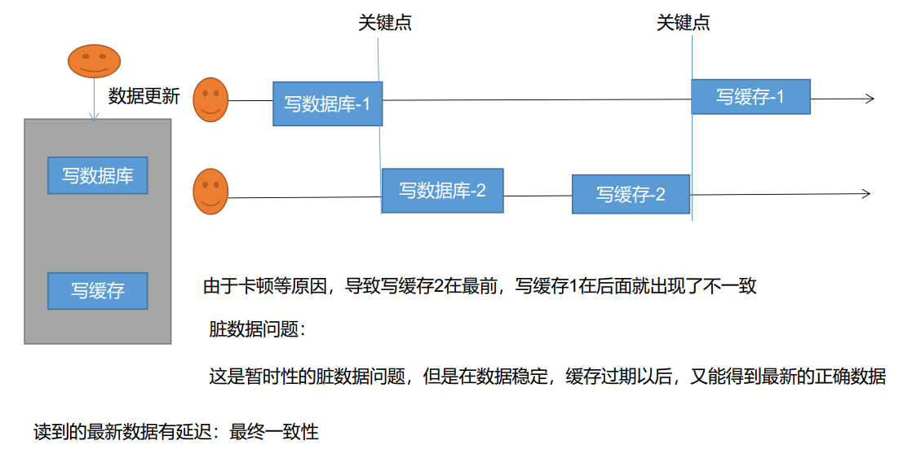

失效模式

失效模式:在数据库进行更新操作时,删除原来的缓存,再次查询数据库就可以更新最新数据

存在问题

脏数据问题：当两个请求同时修改数据库，A已经更新成功并删除缓存时又有读数据的请求进来，这时候发现缓存中无数据就去数据库中查询并放入缓存，在放入缓存前第二个更新数据库的请求B成功，这时候留在缓存中的数据依然是A更新的数据

解决方法

1、缓存的所有数据都有过期时间，数据过期下一次查询触发主动更新
2、读写数据的时候(并且写的不频繁)，加上分布式的读写锁。  这个属于强一致性的解决方案，对一致性要求没那么多的可以不考虑。

对于要经常读取且要保证正确的数据就可以直接去查询数据库，不放入缓存
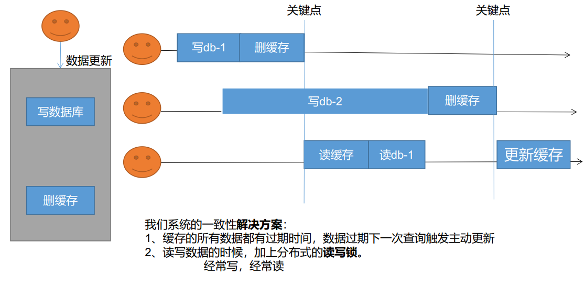

缓存一致性解决方案，读写锁和过期时间                           
无论是双写模式还是失效模式，都会导致缓存的不一致问题。即多个实例同时更新会出事，解决方案：              
1、如果是用户纬度数据（订单数据、用户数据），这种并发几率非常小，不用考虑这个问题，缓存数据加上过期时间，每隔一段时间触发读的主动更新即可                
2、如果是菜单，商品介绍等基础数据，也可以去使用canal订阅binlog的方式。               
3、缓存数据+过期时间也足够解决大部分业务对于缓存的要求。           
4、通过加锁保证并发读写，写写的时候按顺序排好队。只有读读不会被阻塞。所以适合使用读写锁。（业务不关心脏数据，允许临时脏数据可忽略）；
总结：                   
• 我们能放入缓存的数据本就不应该是实时性、一致性要求超高的。所以缓存数据的时候加上过期时间，保证每天拿到当前最新数据即可。                       
• 我们不应该过度设计，增加系统的复杂性                     
• 遇到实时性、一致性要求高的数据，就应该查数据库，即使慢点。

缓存中间件Canal             
Canal是阿里的缓存中间件，Canal将自己伪装成数据库的从服务器，MySQL一有变化，它就会同步更新到redis。 
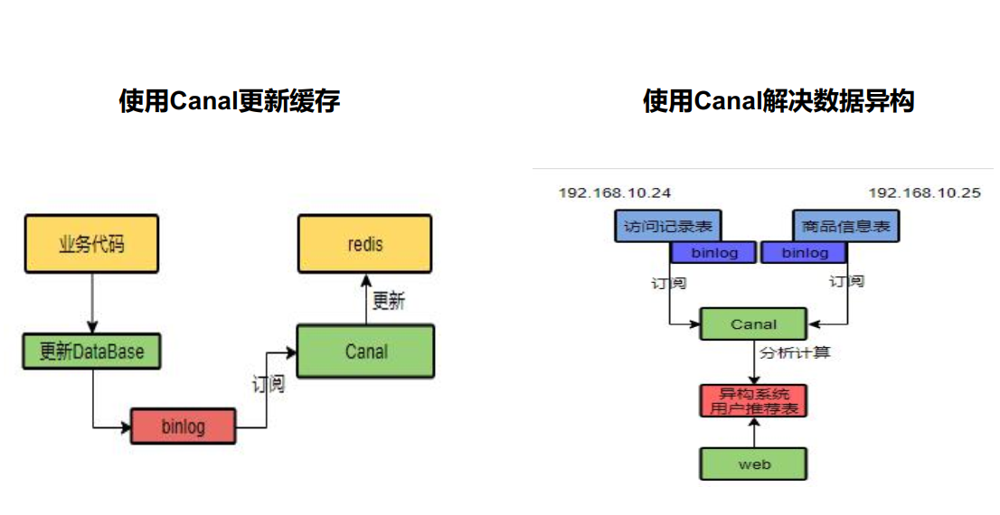

SpringCache
Spring 从 3.1 开始定义了 org.springframework.cache.Cache和 org.springframework.cache.CacheManager 接口来统一不同的缓存技术；并支持使用 JCache（JSR-107） 注解简化我们开发；
Cache 接口为缓存的组件规范定义， 包含缓存的各种操作集合；Cache 接 口 下 Spring 提 供 了 各 种 xxxCache 的 实 现 ； 如 RedisCache ， EhCacheCache ,ConcurrentMapCache 等；
每次调用需要缓存功能的方法时， Spring 会检查检查指定参数的指定的目标方法是否已经被调用过； 如果有就直接从缓存中获取方法调用后的结果， 如果没有就调用方法并缓存结果后返回给用户。 下次调用直接从缓存中获取。
使用 Spring 缓存抽象时我们需要关注以下两点；
1、 确定方法需要被缓存以及他们的缓存策略
2、 从缓存中读取之前缓存存储的数据

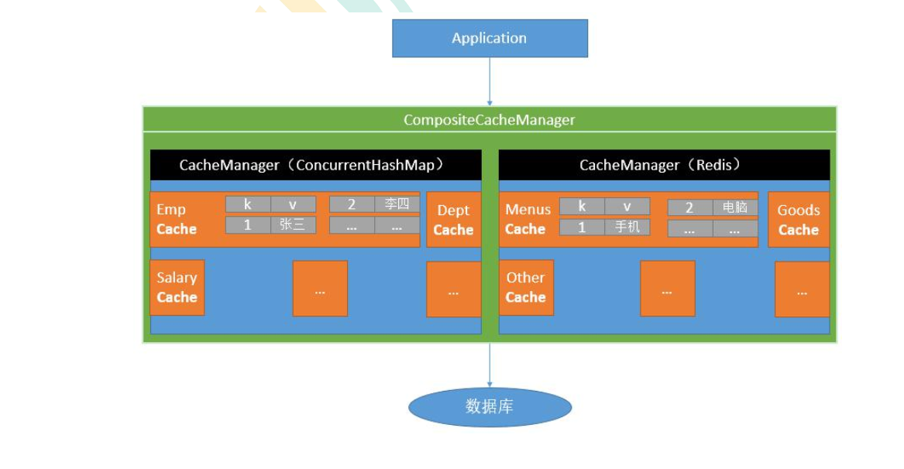

注解
Cache	缓存接口,定义缓存操作.实现有:RedisCache,RhCacheCache,ConcurrentMapCache等                                
CacheManager	缓存管理器,管理各种缓存组件                             
@Cacheable	主要针对方法配置,能够根据方法的请求参数对其结果进行缓存                          
@CacheEvict	清空缓存                             
@CachePut	保证方法被调用,又希望结果被缓存                   
@Caching	组合上面三个注解多个操作                  
@EnableCaching	开启基于注解的缓存                  
@CacheConfig	在类级别分享缓存的相同配置           
keyGenerator	缓存数据是key生成策略         
serialize	缓存数据是value序列化策略
 
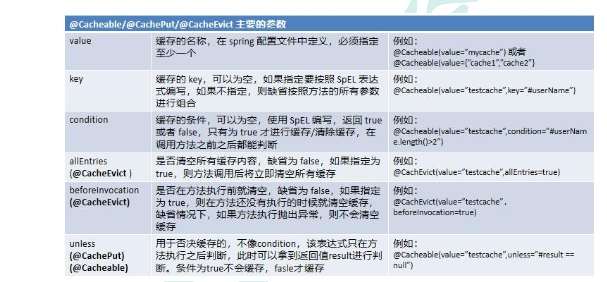

SpEL表达式语法

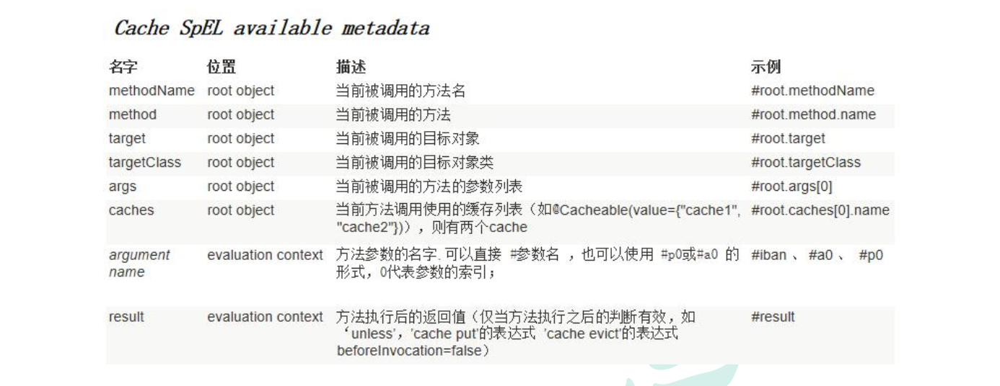

整合SpringCache简化缓存开发
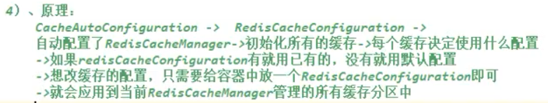

导入依赖：
<!--Spring Cache-->         
<dependency>            
<groupId>org.springframework.boot</groupId>         
<artifactId>spring-boot-starter-cache</artifactId>          
</dependency>           
<!--redis-->            
<dependency>            
<groupId>org.springframework.boot</groupId>         
<artifactId>spring-boot-starter-data-redis</artifactId>             
</dependency>           

配置使用redis作为缓存                           
spring:                         
cache:                                           
type: redis              
开启缓存功能 @EnableCaching           
使用缓存注解                      

    /**
     * 整合springCache简化缓存开发
     * 1.引入依赖
     *   写配置 CacheAutoConfiguration会导入RedisConfiguration
     *   自动配置了缓存管理器RedisCacheManager
     * 2.配置使用redis作为缓存
     * 3.测试使用缓存
     *   @Cacheable 主要针对方法配置, 能够根据方法的请求参数对其结果进行缓存  ：触发将数据保存到缓存的操作
     *   @CacheEvict 清空缓存                                        ：  触发将数据从缓存删除的操作
     *   @CachePut 保证方法被调用, 又希望结果被缓存                      ：   不影响方法执行的方式更新缓存
     *   @Caching 组合上面三个注解多个操作                             ： 组合以上多个操作
     *   @EnableCaching 开启基于注解的缓存
     *   @CacheConfig 在类级别分享缓存的相同配置                      ：  在类级别分享缓存的相同配置
     *   @Cacheable：标注方法上：当前方法的结果存入缓存，如果缓存中有，方法不调用
     *   @CacheEvict：触发将数据从缓存删除的操作
     *   @CachePut：不影响方法执行更新缓存
     *   @Caching：组合以上多个操作
     *   @CacheConfig：在类级别共享缓存的相同配置
     *
     * 4.原理：CacheAutoConfiguration->RedisCacheConfiguration->自动配置了RedisCacheManager->初始化所有的缓存->每个缓存决定使用什么配置
     *        ->如果RedisCacheConfiguration有就用已有的，没有就用默认配置->如果要改配置，只需要给容器中增加一个RedisCacheConfiguration即可
     *        ->就会应用到当前RedisCacheManager管理的所有缓存分区中
     *
     *    1.开启缓存功能     配置spring.cache.type: redis  启动类加@EnableCaching
     *    2.只需要使用注解就能完成缓存操作
     *    使用springcache对获取一级菜单加缓存
     *        //每一个需要缓存的数据都需要指定放到哪个名字的缓存(缓存的分区，按照业务类型分)
     *     @Cacheable ({ " category " })   //代表当前方法的结果需要缓存  如果缓存中有，那该方法就不会被调用，如果缓存中没有就调用该方法，最后将方法的结果放入缓存
     *     位置：com.atcode.watermall.product.service.impl.CategoryServiceImpl
     *    3.默认行为：
     *       1.缓存中有，那么不调用这个被注解的方法；缓存中没有，调用该方法把数据存到缓存中
     *       2.key自动生成： 缓存的名字 :: SimpleKey
     *       3.缓存的value的值：默认使用jdk序列化机制，将序列化后的结果存到redis
     *       4.默认ttl时间：-1(永不过期)
     *    4.自定义：
     *            1. 指定生成的缓存使用的key  key属性指定，接收一个SpEl表达式
     *                 @Cacheable (value = {"category"},key = "#root.method.name") value用数组是因为可以放入多个缓存区，比如分类区和product区
     *                 @Cacheable (value = {"category"},key = "'Level1Categorys'")  key直接传字符串
     *            2. 指定缓存的数据的存活时间
     *            3. 将数据保存为json格式  位置：com.atcode.watermall.product.config.MyCacheConfig
     *            配置信息：spring:
     *                           cache:
     *   	                    #指定缓存类型为redis
     *                           type: redis
     *                          redis:
     *                          # 指定redis中的过期时间为1h
     *                           time-to-live: 3600000
     *                           key-prefix: CACHE_   #缓存key前缀
     *                           use-key-prefix: true #是否开启缓存key前缀
     *                           cache-null-values: true #缓存空值，解决缓存穿透问题
     *
     */

    /**
     * SpringCache原理与不足
     * 1、读模式
     * 缓存穿透：
     *
     * 查询一个null数据。解决方案：缓存空数据，可通过spring.cache.redis.cache-null-values=true
     * 缓存击穿：
     *
     * 大量并发进来同时查询一个正好过期的数据。解决方案：加锁 ? 默认是无加锁的;
     * 使用sync = true来解决击穿问题
     * 缓存雪崩：
     *
     * 大量的key同时过期。解决：加随机时间。
     * 2、写模式：（缓存与数据库一致）
     * 读写加锁。
     *
     * 引入Canal，感知到MySQL的更新去更新Redis
     *
     * 读多写多，直接去数据库查询就行
     *
     * 3、总结
     * 常规数据（读多写少，即时性，一致性要求不高的数据，完全可以使用Spring-Cache）：
     * 写模式(只要缓存的数据有过期时间就足够了)
     * 特殊数据：
     * 特殊设计（读写锁等）
     */

异步与线程：                    
位置：com.atcode.watermall.product.thread.ThreadTest.ThreadTest01
/**
* 初始化线程的4种方式
* 1.1 继承 Thread类，重写run()方法
* public static class ThreadTest001 extends Thread{
*         @Override
*         public void run() {
*             System.out.println("当前线程id:  "+Thread.currentThread().getId());
*             int i = 10/2;
*             System.out.println("当前线程的运行结果:  "+ i);
*
*         }
*
*   public static void main(String[] args) {
*
*         ThreadTest001 thread = new ThreadTest001();
*         thread.start();
*
*     }
* 1.2 实现 Runnable 接口，重写run()方法
*     public static class ThreadTest002 implements Runnable{
*
*         @Override
*         public void run() {
*             System.out.println("当前线程id:  "+Thread.currentThread().getId());
*             int i = 10/2;
*             System.out.println("当前线程的运行结果:  "+ i);
*
*         }
*     }
*
*      public static void main(String[] args) {
*
*         System.out.println("main...start...");
*         Runnable runnable = new ThreadTest002();
*
*         new Thread(runnable).start();
*         System.out.println("main...end...");
*
*     }
* 1.3 实现 Callable 接口 ， FutureTask （可以拿到返回结果， 可以处理异常）
*      public static class ThreadTest003 implements Callable<Integer> {
*
*         @Override
*         public Integer call() throws Exception {
*             System.out.println("当前线程id:  "+Thread.currentThread().getId());
*             int i = 10/2;
*             System.out.println("当前线程的运行结果:  "+ i);
*
*             return i;
*         }
*     }
*      public static void main(String[] args) throws ExecutionException, InterruptedException {
*
*         System.out.println("main...start...");
*         FutureTask<Integer> futureTask = new FutureTask<>(new ThreadTest003());
*         new Thread(futureTask).start();
*         Integer integer = futureTask.get();  //阻塞方法，等线程执行完之后再执行
*         System.out.println("main...end..."+integer);
*
*     }
* 1.4 创建线程池直接提交任务（推荐）
* 四种创建线程方法的区别
* 区别：
* 1、2不能得到返回值。3可以获取返回值
* 1、2、3都不能控制资源
* 4可以控制资源，性能稳定，不会一下子所有线程一起运行
* 总结：
* 1、实际开发中，只用线程池【高并发状态开启了n个线程，会耗尽资源】
* 2、当前系统中线程池只有一两个，每个异步任务提交给线程池让他自己去执行
  */                 
线程池理解：
位置：com.atcode.watermall.product.thread.ThreadTest.ThreadTest01

        /**
         * 线程池[ExecutorService]
         * 创建线程池来执行异步任务
         * 方式1 ：Executors
         * 方式2 ：new ThreadPoolExecutor()
         */

        /**
         * 线程池七大参数
         * 1.corePoolSize[5]:  核心线程数[一直存在除非设置了allowCoreThreadTimeOut]  线程创建好以后准备就绪的线程数量，就等待来接受异步任务去执行。
         *                      5个 Thread thread = new Thread();
         * 2.maximumPoolSize[200]:  最大线程数量 控制资源
         * 3.keepAliveTime:  存活时间  如果当前线程的数量大于核心线程(core)的数量
         *                   释放空闲的线程(maximumPoolSize-corePoolSize),只要空闲线程大于指定的keepAliveTime
         * 4.unit: 时间单位
         * 5.BlockingQueue<Runnable> workQueue: 阻塞队列。如果任务有很多，就会把多的任务放到队列里。
         *                                      只要有线程空闲，就会去队列里面取出新的任务继续执行
         * 6.ThreadFactory threadFactory: 线程的创建工厂
         * 7.RejectedExecutionHandler handler: 如果队列满了，按照我们的拒绝策略拒绝执行任务
         *
         * 执行顺序:
         * 1.线程池创建，准备好core数量的核心线程，准备接受任务.
         * 2.core满了之后，就将新来的任务放到阻塞队列中，空闲的core就会自己去阻塞队列中获取任务执行
         * 3.阻塞队列满了就会开新线程执行，最大能开到maximumPoolSize所指定的数量
         * 4.maximumPoolSize满了之后就执行RejectedExecutionHandler拒绝策略拒绝任务
         * 5.max线程都执行完任务进入空闲，在等待keepAliveTime时间之后，被释放，释放数量应该为maximumPoolSize-corePoolSize
         *            new LinkedBlockingDeque<>(),默认是Integer的最大值，但是会内存不够 里面的参数可以使用压力测试之后能达到的峰值
         * 6.ThreadFactory可以使用默认的线程工厂，内部做的处理是将Runnable封装成Thread
         * 7.丢弃策略：后续补充  默认的丢弃策略 new ThreadPoolExecutor.AbortPolicy()
         */

        /**
         * 丢弃策略：
         * RejectedExecutionHandler handler：拒绝策略。如果任务队列和最大线程数量满了，按照指定的拒绝策略执行任务。
         * Rejected：丢弃最老的
         * Caller：调用者同步调用，直接调用run方法，不创建线程了
         * Abort （默认）：直接丢弃新任务
         * Discard：丢弃新任务，并且抛出异常
         *
         * 1、丢弃最老的 Rejected
         * 2、调用者同步调用，直接调用run方法，不创建线程了 Caller
         * 3、直接丢弃新任务 Abort 【默认使用这个】
         * 4、丢弃新任务，并且抛出异常 Discard
         *
         */

        /**
         * 一个线程池 core 7； max 20 ， queue： 50， 100 并发进来怎么分配的；
         * 先有 7 个能直接得到执行， 接下来 50 个进入队列排队， 在多开 13 个继续执行。 现在 70 个任务已经被安排上了，剩下 30 个默认拒绝策略
         */

        /**
         *  使用线程池的好处
         * 1、降低资源的消耗【减少创建销毁线程的开销】
         * 通过重复利用已经创建好的线程降低线程的创建和销毁带来的损耗
         *
         * 2、提高响应速度【控制线程个数】
         * 因为线程池中的线程数没有超过线程池的最大上限时,有的线程处于等待分配任务的状态，当任务来时无需创建新的线程就能执行
         *
         * 3、提高线程的可管理性【例如系统中可以创建两个线程池，核心线程池、非核心线程池【短信等】，关闭非核心线程池释放内存资源】
         * 线程池会根据当前系统特点对池内的线程进行优化处理，减少创建和销毁线程带来的系统开销。无限的创建和销毁线程不仅消耗系统资源，还降低系统的稳定性，使用线程池进行统一分配
         */

        /**
         * 执行器工具类的4种线程池
         * 1、newCachedThreadPool：缓存线程池。核心线程数是0，如果空闲会回收所有线程
         *
         * 创建一个可缓存线程池， 如果线程池长度超过处理需要， 可灵活回收空闲线程， 若无可回收， 则新建线程。
         *
         * 2、newFixedThreadPool：固定大小的线程池。核心线程数 = 最大线程数，【不回收】
         *
         *  创建一个定长线程池， 可控制线程最大并发数， 超出的线程会在队列中等待。
         *
         * 3、newScheduledThreadPool：定时任务线程池。多久之后执行【可提交核心线程数，最大线程数是Integer.Max】
         *
         *  创建一个定长线程池， 支持定时及周期性任务执行。
         *
         * 4、newSingleThreadPool：单线程化的线程池。核心与最大都只有一个【不回收】,后台从队列中获取任务
         *
         *  创建一个单线程化的线程池， 它只会用唯一的工作线程来执行任务， 保证所有任务按照指定顺序(FIFO, LIFO, 优先级)执行。

         */
        ThreadPoolExecutor executor = new ThreadPoolExecutor(
                5,
                200,
                10,
                TimeUnit.SECONDS,
                new LinkedBlockingDeque<>(100000),
                Executors.defaultThreadFactory(),
                new ThreadPoolExecutor.AbortPolicy());

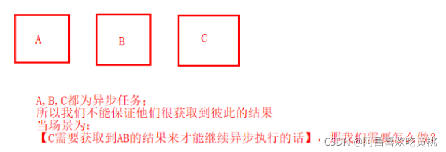

    /**
     * CompletableFuture 异步编排
     * 当我们在异步任务编程的时候，可能会有场景如下：
     *
     * 可能你会想到用之前我们学到的Callable的方式去获取结果后，再执行；
     *
     * 但是这样子不能保证是异步与异步之间的结果；
     *
     * C不能感知到AB的结果后再异步执行；
     *
     * 所以，这里我们就引出了 CompletableFuture
     *
     * Future：可以获取到异步结果
     *
     */

        /**
         * whenComplete 方法完成后的感知  成功时完成回调 只能感知结果不能处理
         * handle  能感知结果，异常，处理结果  （方法执行完之后的处理，无论是成功完成还是失败完成）
         * thenApply thenRun  线程串行化  加Async指新开一个线程执行，不加指共用一个线程
         */

//        CompletableFuture.runAsync(()->{
//            System.out.println("当前线程id:  "+Thread.currentThread().getId());
//            int i = 10/2;
//            System.out.println("当前线程的运行结果:  "+ i);
//        },executor);

    public static void main(String[] args) throws ExecutionException, InterruptedException {
        ExecutorService executor = Executors.newFixedThreadPool(10);

        //不带返回值的runAsync

        /**
         * whenComplete 成功时完成回调
         */
        System.out.println("main...start...");
        CompletableFuture<Integer> future = CompletableFuture.supplyAsync(() -> {
            System.out.println("当前线程id:  " + Thread.currentThread().getId());
            int i = 10 / 0;  //模拟异常
            System.out.println("当前线程的运行结果:  " + i);
            return i;
        }, executor).whenComplete((result,exception)->{
            //虽然能得到异常信息，但是没法修改返回数据
            System.out.println("异步任务完成了...结果是"+result+";  异常是："+exception);
        }).exceptionally(throwable -> {
            //可以感知异常同时返回默认值
            return 10;
        });
        // R apply(T t);
        System.out.println("main...end...最终返回结果: "+future.get());
    }        } 

/**
*       //方法执行完成之后的处理，无论是成功完成还是失败完成
*         System.out.println("main...start...");
*                 CompletableFuture<Integer> future = CompletableFuture.supplyAsync(() -> {
*             System.out.println("当前线程id:  " + Thread.currentThread().getId());
*             int i = 10 / 0;  //模拟异常
*             System.out.println("当前线程的运行结果:  " + i);
*             return i;
*         }, executor).handle((res,thr)->{
*             if(res!=null){return res*2;}
*             if(thr!=null){return 0;}
*             return 0;
*                 });
*         //    R apply(T t, U u);
*         System.out.println("main...end...最终返回结果: "+future.get());
*     }
*/

/**
* RabbitMQ消息队列–1
* 一、MQ队列介绍
* 1、MQ
* 全称 Message Queue，被称为消息队列
*
* 2、回顾队列
* 队列，一种类似于 List 的数据结构，专门来存储数据的队列
*
* 如果要往队列中存数据的话
*
* 可以从队头中存，1先进，存到队列中就是这样：3 -> 2 -> 1，从队尾取的时候，1先出，结果就是这样：1 -> 2 -> 3，这是很典型的先进先出队列
*
* 如果存的方式与上面一样：3 -> 2 -> 1，而取的时候从队头取，3先出，结果就变成了这样：3 -> 2 -> 1，这就是先进后出
*
* 如果队头、队尾都可以放数据，这样的队列被称为双端队列
*
* Java 中也提供 Queue 的相关操作，但是 Java 里面的 API 都是基于内存级别的，而我们的微服务使用它的 API 来保存数据，那最多只能在它的机器里面使用
*
* 分布式系统中，我们需要消息中间件 ，是安装在服务器里的，我们的消息全部保存到这个服务器里面，所有微服务都可以通过这个服务器取消息，而 RabbitMQ 就是我们要使用的消息中间件
*
* 3、RabbitMQ使用场景
* ①异步处理
* 假设我们的一个普通业务，以用户注册为例，用户通过浏览器提交了账号、密码等注册信息，注册信息可能分为以下这三步
*
*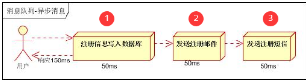
*
* 这是一种同步模式，用户在每一个步骤都会花费 50ms 的时间，加起来就是 150ms 的时间， 我们发现这是没有必要的
*
* 尤其是第2步跟第3步，如果我们使用下面这种模式，可以给它弄一个异步
*
*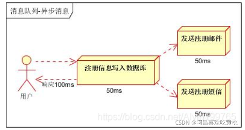
*
* 用户将注册信息写入到数据库之后，我们创建两个异步任务，一个发送注册邮件，一个发送注册短信，当然我们需要最终的完整返回，但是我们只需要等待时间最长的一个返回，就可以获取到两个结果
*
* 这样，我们就将时间缩短到了 100ms ，看起来时间更快了，但是实际上，我们连异步都不需要
*
* 因为，我们发现注册邮件、注册短信，这两个任务，让它在后台慢慢发就行，成功或是失败，我们无需知道，只要它做了这个事就行，而且我们经常会有收不到短信、收不到邮件的情况，所以，遇到这种情况，我们还可以使用下面这种方式
*
*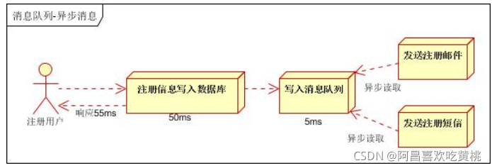
*
* 我们如果将注册信息写入数据库成功了，接下来，我们将注册成功的消息写入消息队列，保存在消息中间件这个服务器中，假设：保存了一个1号用户注册成功的消息，至此，我们就直接给用户返回
*
* 因为给消息中间件写消息这个耗时是非常短的，数据库插入数据库可能很慢，需要 50ms ，而写消息，类似于直接操作 redis 一样，可能只花费 5ms，很快，那么用户收到这个响应只需要 55ms，但是用户能不能收到邮件、短信呢？
*
* 也可以，我们的消息既然存到了消息队列里面，别的服务就可以从消息队列里面拿到这个消息，假设：这个服务拿到1号用户注册成功的消息了，那么它就在后台该发邮件发邮件，该发短信发短信，我们不关心它什么时候发短信、发邮件，只要它干了这个事就行，但是用户会一起响应成功。
*
* 总结
* 这就是异步处理，使用起来比异步任务更快，异步任务我们还必须等待消息返回，而这个异步处理，只需要给消息中间件的服务器发一个消息，让它在后台慢慢处理就行。
  */

/**
* ②应用解耦   把原来的一个系统调用另一个系统的接口的方式简化为一个系统给中间件发消息由另一个系统去进行实时订阅并分析
* 我们以下订单为例：比如，我们下了一个订单，我们下完订单之后，需要做出库操作，像我们以前做的，一般是使用下面这种方式
*
*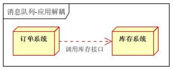
*
* 假设订单系统有3个参数，库存系统有5个参数，直接调用就可以，如果这个库存系统不升级，API 也不变，一直是这几个参数还好，
*
* 假设我们库存系统经常会升级， 减库存的接口经常发生变化，这样我们以前的这种调用方式，一旦库存系统升级了，则订单系统必须修改它的源代码，重新部署，这样就感觉会非常麻烦，所以我们可以引入消息队列，
*
* 订单系统只要下好订单，我们给消息队列里面写上一个消息，说我们哪个用户下了哪个订单购买了哪个商品，把这个消息保存到队列里面，我们不关心库存系统的接口是什么样，不管它要几个参数，我们只需要把我们的消息写进去，接下来库存系统要实时订阅我们队列里面的内容，只要有内容，库存系统就会收到我们订单系统写的消息，然后它自己分析消息，然后对库存进行修改
*
*
*
* 总结
* 此时，我们发现，订单系统执行完任务之后，我们无需关心库存系统要调用什么接口，我们只需要写消息即可，所以我们就实现了应用解耦
*
* 以后，无论什么系统，想要知道我们订单成功之后要做什么，只需要订阅消息队列中订单成功的消息，
*
* 而订单系统不需要关心别的系统接口设计成什么样子，因为订单系统根本就不会调用它们
*
* ③流量控制（流量削峰）
* 针对一些秒杀业务来说，瞬间流量会非常大，比如：瞬间百万个请求都要进来秒杀一个商品，这个商品要真正去执行业务，就算我们前端服务器可以接受百万请求，我们要执行业务代码，因为我们秒杀完之后，要下订单，整个流程会非常慢， 后台会一直阻塞，可能就会导致资源耗尽，最终导致宕机
*
* 此时，我们可以这样做，我们让大并发的请求全部进来，进来以后，先将它们存储到消息队列里面，存到消息队列以后，我们就可以不用管这个请求该怎么做了，直接给它响应：秒杀成功了或者其他
*
* 然后，消息队列中，后台真正的业务处理要下订单、减库存等等这些业务处理，我们不着急立即调用，只要存到消息队列里面，这些业务去订阅消息队列里面进来的这些秒杀请求，接下来，挨个处理：下订单…，即使后台每秒只能处理1个，那100W请求，也就花费100W秒，但永远都不会导致机器的资源耗尽，导致宕机所以我们可以达到前端的流量控制。
*
*
*
* 总结
* 我们把所有的流量存到队列里面，后台根据它的能力，去来进行消费处理，不会导致机器宕机，这就是流量控制，也被称为流量削峰，将峰值削下来，全部存到队列里面
*
* 二、RabbitMQ概述
* 1、简介
* RabbitMQ是一个由erlang开发的AMQP(Advanved Message Queue Protocol)的开源实现。
*
* ①大多应用中，可通过消息服务中间件来提升系统异步通信、扩展解耦的能力
* ②消息服务中两个重要概念
* 消息代理（message broker）和目的地（destination）
*
* 消息代理：指的是一个代理代替我们发送、接收消息，
*
* 简单理解就是，安装了消息中间件的服务器，发消息得用它发，接收消息也得连上它，才能拿到
* 目的地：指消息的目标位置
*
* 发消息的整体流程：
*
* 当消息发送者要发送消息时，这个消息会先发给消息代理（也就是消息中间件服务器broker），消息代理会发到我们指定的目的地
*
* ③消息队列主要有两种形式的目的地
* 队列（queue）：
*
* 点对点消息通信（point-to-point）
*
* 主题（topic）：
*
* 发布（publish）/订阅（subscribe）消息通信
*
* 只要是消息中间件，一定会有这两种模式
*
* ④点对点式通信（队列式）
* 消息发送者发送消息，首先发送给消息代理， 消息代理收到消息之后，如果消息发送者说要发给一个队列，消息代理就会将其放入一个队列中，队列都是先进先出，消息先进来就会先取到，
*
* 别人如果要获取队列中的消息，怎么办？
*
* 别人可以监听队列里的消息内容，一旦队列里面有消息，这个人就可以拿到消息 ，
*
* 总结
*
* 消息有唯一的发送者、接收者， 也就是说谁发送消息这是肯定的，谁最终拿到消息这也是肯定的，但是并不是说只能有一个接收者 ，可以很多人都来接收队列里面的消息，队列可以允许很多人同时监听消息
*
* 但是如果是点对点式（队列式），消息放到队列之后，可以有很多人监听 ，最终只会交给一个人， 谁先抢到，就是谁的
*
* 消息一旦被别人抢到，就会从队列中移除，队列里面就没有这个消息了
*
* ⑤发布订阅式  相当于广播
* 发送者（发布者）先将消息发给消息代理， 消息代理要将消息发送到主题，这个主题可以有多个接收者（订阅者）同时监听（订阅），跟队列一样，
*
* 如果是队列，那么多个人监听，最终只会有一个人收到消息，
*
* 但如果是一个主题，主题是一种发布订阅模式，只要消息一到达，那么所有订阅消息的人都能收到消息
*
* ⑥消息队列规范
* JMS（Java Message Service）JAVA消息服务
*
* 基于JVM消息代理的规范。ActiveMQ、HornetMQ是JMS实现
*
* ⑦消息队列协议
* AMQP（Advanced Message Queuing Protocol）
*
* 高级消息队列协议，也是一个消息代理的规范，兼容JMS
* 
* RabbitMQ是AMQP的实现
* 
* ⑧规范与协议的对比
* JMS（Java Message Service）	AMQP（Advanced Message Queuing Protocol）
* 定义	Java api	网络线级协议
* 跨语言	否	是
* 跨平台	否	是
* Model	提供两种消息模型： （1）、Peer-2-Peer （2）、Pub/sub	提供了五种消息模型： （1）、direct exchange （2）、fanout exchange （3）、topic change （4）、headers exchange （5）、system exchange 本质来讲，后四种和JMS的pub/sub模型没有太大差别， 仅是在路由机制上做了更详细的划分；
* 支持消息类型	多种消息类型： TextMessage MapMessage BytesMessage StreamMessage ObjectMessage Message （只有消息头和属性）	byte[] 当实际应用时，有复杂的消息，可以将消息序列化后发 送。
* 综合评价	JMS 定义了JAVA API层面的标准；在java体系中， 多个client均可以通过JMS进行交互，不需要应用修 改代码，但是其对跨平台的支持较差；	AMQP定义了wire-level层的协议标准；天然具有跨平 台、跨语言特性。
* ⑨Spring支持
* spring-jms提供了对JMS的支持
*
* spring-rabbit提供了对AMQP的支持
*
* 需要ConnectionFactory的实现来连接消息代理
*
* 提供JmsTemplate、RabbitTemplate来发送消息
*
* @JmsListener(JMS)、@RabbitListener(AMQP)注解在方法上监听消息代理发布的消息
*
* @EnableJms、@EnableRabbit开启支持
*
* ⑩Spring Boot自动配置
* JmsAutoConfiguration
* RabbitAutoConfiguration
* 2、RabbitMQ工作流程
*
*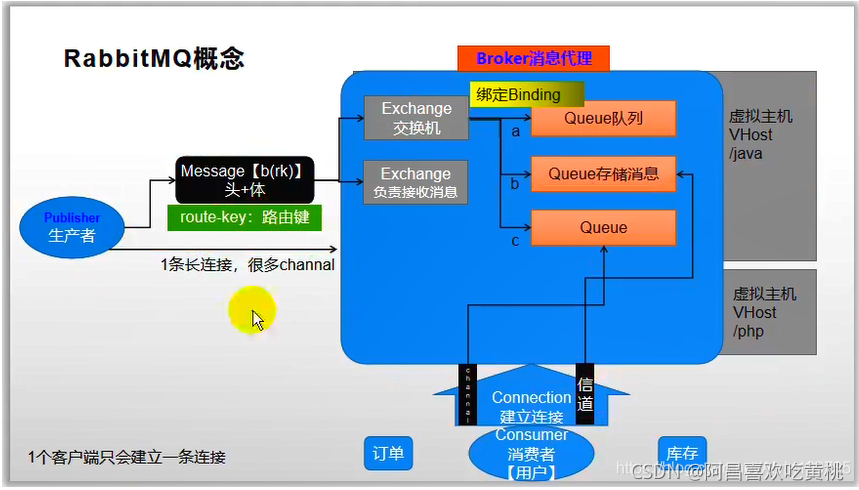
                     
 大致的运行流程：
消息生成者发送一个消息，消息先发给消息代理（Broker），由代理先将消息交给（Exchange）交换机，然后这个交换机下面可能会绑定（Bingdings）了很多队列（Queues），所以一个交换机跟很多种队列都有绑定关系，
一个交换机可以绑定很多队列，一个队列也可以被多个交换机绑定，所以它们之间有非常复杂的绑定关系，
接下来就由交换机决定，消息要按照什么绑定关系路由给哪个消息队列，这个关系就是消息路由
这个路由是根据一开始发的 路由键（routing-key）指定的，由于这个消息是先发送给交换机，所以交换机不一样，它绑定关系不一样，最终路由到的地方也不一样，消费者收到的消息就不一样
* ①流程
* 无论是生产者（Publisher）想要发消息（Message），还是消费者（Consumer）要接消息（Message），它们都必须跟 RabbitMQ 建立一条连接（Connection）
* 所有的收发数据都需要在连接（Connection）里面开辟信道（Channel）进行收发，想要收发的都是消息（Message），所以我们要构造一个消息（Message），消息有头有体，头相当于是对参数的一些设置、命令，体就是消息的真正内容，而消息里面最重要的一个就是路由键（routing-key）
* 我们将消息指定好**路由键（routing-key）**要发给谁以后，消息（Message）先来到消息代理（Broker）指定的一个虚拟主机（Virtual Host）里边， 由虚拟主机（Virtual Host）里边指定交换机（Exchange）
* 这就相当于我们要发消息（Message）的时候，我们还要指定好要发给哪个交换机（Exchange）
* 由指定的交换机（Exchange）收到消息以后，它根据我们指定的路由键（routing-key），通过交换机跟其它队列（Queue）的绑定关系，将这个消息放到哪个队列（Queue）
* 然后消费者（Consumer）就会监听这个队列，队列里面的内容就会被消费者（Consumer）实时拿到，当然也是通过信道（Channel）拿到的
* ②Message
* 消息，消息是不具名的，它由消息头和消息体组成。消息体是不透明的，而消息头则由一系列的可选属性组成，这些属性包括routing-key（路由键）、priority（相对于其他消息的优先权）、delivery-mode（指出该消息可能需要持久性存储）等。
*
* ③Publisher
* 消息的生产者，也是一个向交换器发布消息的客户端应用程序。
*
* ④Exchange
* 交换机 ，用来接收生产者发送的消息，并将这些消息路由给服务器中的队列。
* Exchange有4种类型：
*
* direct(默认)、fanout、topic、headers，不同类型的Exchange转发消息的策略有所区别
*
* ⑤Queue
* 消息队列，用来保存消息直到发送给消费者。它是消息的容器，也是消息的终点。一个消息可投入一个或多个队列。消息一直在队列里面，等待消费者连接到这个队列将其取走。
*
* ⑥Binding
* 绑定，用于消息队列和交换器之间的关联。一个绑定就是基于路由键将交换器和消息队列连接起来的路由规则，所以可以将交换器理解成一个由绑定构成的路由表。
* Exchange 和 Queue 的绑定可以是多对多的关系。
*
* ⑦Connection
* 网络连接，比如一个TCP连接。
*
* ⑧Channel
* 信道，多路复用连接中的一条独立的双向数据流通道。信道是建立在真实的TCP连接内的虚拟连接，AMQP 命令都是通过信道发出去的，不管是发布消息、订阅队列还是接收消息，这些动作都是通过信道完成。因为对于操作系统来说建立和销毁 TCP 都是非常昂贵的开销，所以引入了信道的概念，以复用一条 TCP 连接。
*
* ⑨Consumer
* 消息的消费者，表示一个从消息队列中取得消息的客户端应用程序。
*
* ⑩Virtual Host
* 虚拟主机，表示一批交换器、消息队列和相关对象。
*
* 虚拟主机是共享相同的身份认证和加密环境的独立服务器域。每个 vhost 本质上就是一个 mini 版的 RabbitMQ 服务器，拥有自己的队列、交换器、绑定和权限机制。
*
* vhost 是 AMQP 概念的基础，必须在连接时指定，RabbitMQ 默认的 vhost 是 / 。
*
* 11.Broker
* 表示消息队列服务器实体
*
*
*
* 3、RabbitMQ运行机制
*
*
* 消息生成者发送一个消息，消息先发给消息代理（Broker），由代理先将消息交给（Exchange）交换机，然后这个交换机下面可能会绑定（Bingdings）了很多队列（Queues），所以一个交换机跟很多种队列都有绑定关系，
* 一个交换机可以绑定很多队列，一个队列也可以被多个交换机绑定，所以它们之间有非常复杂的绑定关系，
* 接下来就由交换机决定，消息要按照什么绑定关系路由给哪个消息队列，这个关系就是消息路由
*
* 这个路由是根据一开始发的 路由键（routing-key）指定的，由于这个消息是先发送给交换机，所以交换机不一样，它绑定关系不一样，最终路由到的地方也不一样，消费者收到的消息就不一样
* 三、Docker安装RabbitMQ
* # 运行，第一次没安装会自动安装
* docker run -d --name rabbitmq -p 5671:5671 -p 5672:5672 -p 4369:4369 -p 25672:25672 -p 15671:15671 -p 15672:15672 rabbitmq:management
*
* # 开机自启
* docker update rabbitmq --restart=always
* 1
* 2
* 3
* 4
* 5
*
*
* 4369, 25672 (Erlang发现&集群端口)
*
* 5672, 5671 (AMQP端口)
*
* 15672 (web管理后台端口)
*
* 61613, 61614 (STOMP协议端口)
*
* 1883, 8883 (MQTT协议端口)
*
* 访问web管理测试是否成功:http://192.168.109.101:15672/
*
* 默认账号密码为：guest/guest
*
*
*
* 四、Exchange（交换机）
* Exchange分发消息时根据类型的不同分发策略有区别，目前共四种类型：
*
* direct：直接（精确匹配）
*
* fanout：广播类型（订阅的都收到）
*
* topic：主题，就是发布订阅那种模式（部分匹配广播）
*
* headers ：headers 匹配 AMQP 消息的 header 而不是路由键，headers 交换器和 direct 交换器完全一致，但性能差很多，目前几乎用不到了，所以直接看另外三种类
*
* direct、header 是一致的，它们都是JMS中说的点对点通信方式实现
*
* fanout、topic则是发布订阅的一些实现
*
* 交换机的类型不同，最终路由到的地方就不一样
*
* 1、Web操作
* ①创建一个交换机
*
*
* ②创建一个队列
*
*
* ③交换机绑定队列
*
*
*
*
* 一创建之后，点进交换机，交换机的绑定关系里面，就会发现已经与队列 indi 绑定上了
*
*
*
* 2、交换机类型
* ①Direct Exchange（直接交换机）
* 精确匹配，指定给谁就发给谁
*
*
*
* 比如，现在有一个直接交换机，它绑定了3个队列，第一个叫 dog，第二个叫 dog.gurad，第三个叫 dog.puppy，如果说消息发送过来，我们用的路由键叫 dog，那它就会精确的只发送给 dog 队列，实现消息最终只能到达一个队列，这就叫直接类型交换机，也称为单播模式、点对点通信
*
* 路由键是跟交换机和队列的绑定关系进行匹配的，我们将这种匹配称之为路由键的完全匹配
*
* 发消息是发给交换机，监听消息是监听队列，交换机将消息交给队列了，那么监听这个队列的人就会拿到消息
*
* ②Fanout Exchange（广播类型交换机）
* 广播发送，发给所有绑定这个交换机的所有队列
*
*
*
* 如果交换机下绑定了3个队列，消息一到达交换机，这3个队列都会收到， 这个消息会广播出去，根本就不关心路由键是什么，把所有消息都通过交换机广播给它绑定的所有队列，被称为广播模式
*
* ③Topic Exchange（主题类型交换机）
* 部分广播，根据条件模糊匹配绑定的队列
*
*
*
* 虽然它也是广播模式，比如它绑定了几个交换机，但是它可以指定某些交换机来发送消息，其余没指定的，则不会收到消息，所以它是部分广播，主要是根据路由键匹配将消息发个队列，这就是主题-发布订阅模式
*
* 它将路由键和绑定键的字符串切分成单词，这些单词之间用点隔开。
*
* 它同样也会识别两个通配符：
*
* **符号 “#” 和符号 “”。
* 1
* #匹配 0 个或多个单词
*
* * 匹配一个单词
*
* 以上面的 usa.# 为例，所有 usa 开头的路由键会进入这个队列，包括只有usa的
*
* 而 #.news ，则是所有以 news 结尾的路由键会进入这个队列，包括只有news的
  */

@RequestBody  将请求体里的数据转换成json集合

位置： com.atcode.watermall.product.service.impl.SpuInfoServiceImpl 267  这里feign在底层将对象转换成了json

        //TODO 这里可以点进去看feign的调用，底层封装了一个requestTemplate
        R r = searchFeignService.productStatusUp(upProducts);
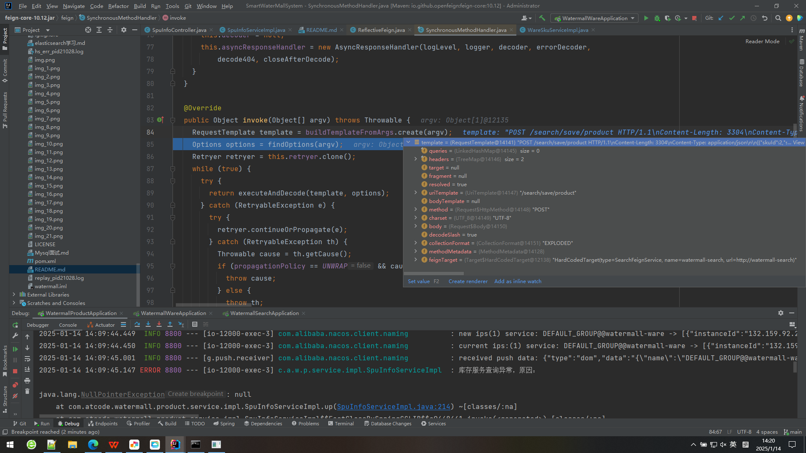

executeAndDecode(template, options);  执行且解码，然后返回Object 

            /**
             * Feign调用流程：
             * 1、构造请求数据，将对象转为json
             *      RequestTemplate template = buildTemplateFromArgs.create(argv);
             * 2、发送请求进行执行（执行成功会解码响应数据）
             *      executeAndDecode(template)
             * 3、执行请求会有重试机制
             *      while(true){
             *          try{
             *              executeAndDecode(template);
             *          }catch(){
             *              retryer.continueOrPropagate(e);
             *              throw ex;
             *              continue;
             *          }
             *      }
             */

位置： com.atcode.watermall.ware.controller.WareSkuController

    /**
     * 查询sku是否有库存
     */
    @PostMapping("hasStock")
    public R getSkusHasStock(@RequestBody List<Long> skuIds){
        // sku_id, stock
        List<SkuHasStockVo> vos = wareSkuService.getSkusHasStock(skuIds);
        R ok = R.ok();
        //TODO 这里保存的数据可能为空   R的类型是hashMap，再使用泛型这里进行setdata会出问题
        ok.setData(vos);
        return ok;
    }
    /**

位置： com.atcode.common.utils.R

	/**
	 * 涉及到不同服务之间调用之后的字符类型转换问题
	 * 	public <T> T getData(TypeReference<T> typeReference) {
	 * 		Object data = get("data");  //默认是map
	 * 		String s = JSON.toJSONString(data);
	 * 		T t = JSON.parseObject(s, typeReference);
	 * 		return t;
	 *        }
	 */
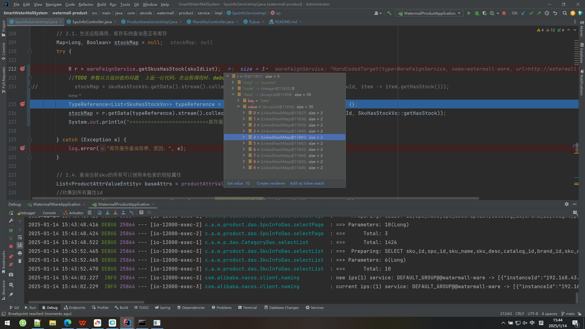

对于重复上架可能会导致的数据多次添加问题
因为每次上架都有唯一的id，因此即使多次点击上架按钮，对于一次添加成功之后，后面的添加均为更新操作(es中)
